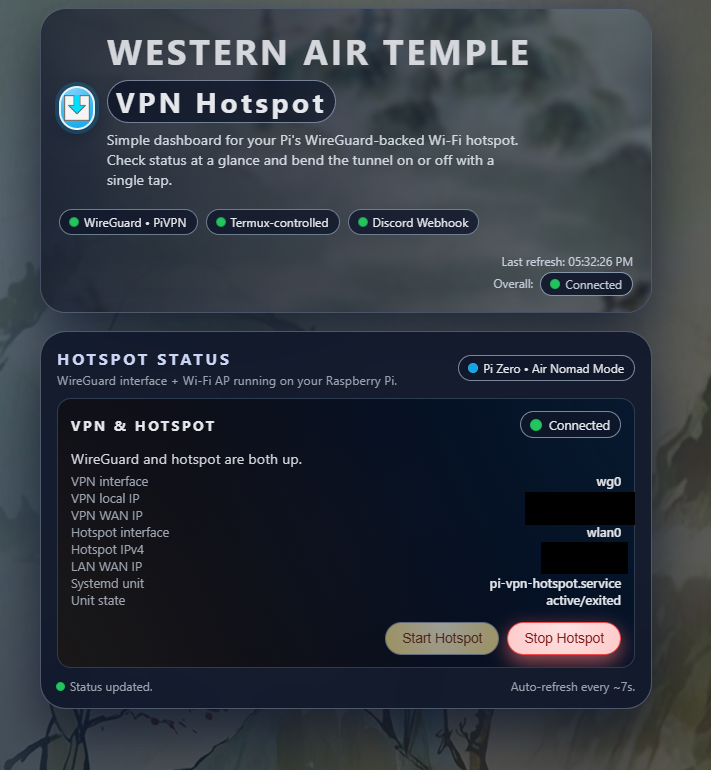

# Pi WireGuard Hotspot
turns your Raspberry Pi into a Wi-Fi hotspot whose traffic is fully routed through a WireGuard tunnel, while your ethernet interface stays on your normal LAN. Also provides a webui for turning off/on and on/off scripts in project root for using with termux widgets

**control the hotspot entirely from your Android phone** using **Termux widgets**. 
- `start-hotspot-pizero` – bring up WireGuard + hotspot + NAT
- `stop-hotspot-pizero` - stop it

# needs
- Ethernet (eth0): stays on LAN to maintain webui and SSH
- wlan0 (default) which turns into an Access Point with its own subnet (e.g. 192.168.50.0/24).
- wireGuard (wg0): outbound interface

Any device connecting to the Pi’s Wi-Fi hotspot gets the **VPN IP** via the WireGuard tunnel.

# ---

Install via `apt` if needed:

- `wireguard` / `wireguard-tools` (PiVPN usually installs these)
- `dnsmasq`
- `hostapd`
- `iptables`
- `iproute2`
- `systemd` (standard on Raspberry Pi OS)
- `python3`, `python3-venv`, `python3-pip`
- `iputils-ping`

replaces:
http://192.168.1.77:3000/tuello/toggable_pi_vpn_us

github:
https://github.com/SourceAirbender/rpi_vpn_hotspot